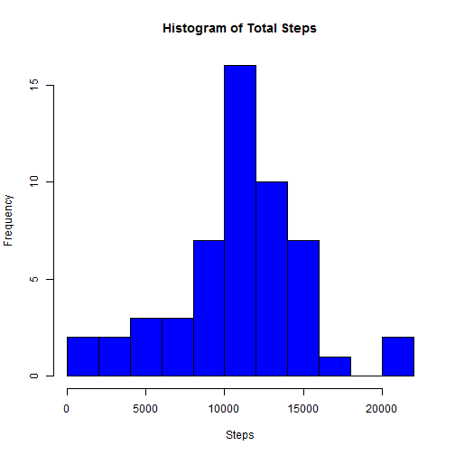
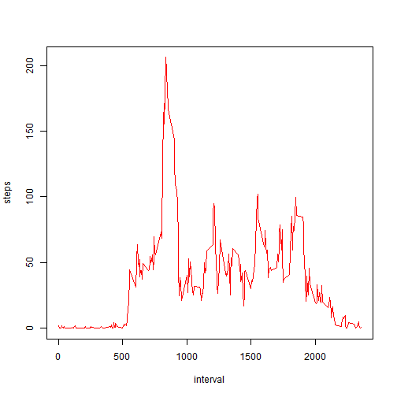
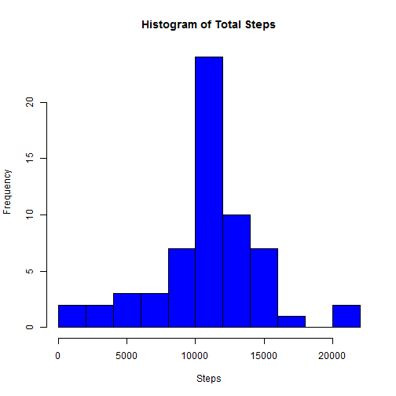
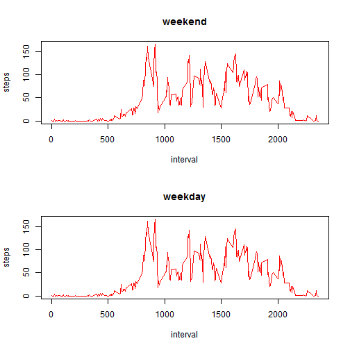

#Programming Assignment 1 of Reproducible Research


-----------------------------------------------------------------
-----------------------------------------------------------------
Loading and preprocessing the data

Show any code that is needed to

1.Load the data (i.e. read.csv())

Loading using read.csv() with stringAsFactors = FALSE to not convert date into factors.


```r
myActData <- read.csv("F:/R-Projects/activity.csv", stringsAsFactors = FALSE)
```

2.Process/transform the data (if necessary) into a format suitable for your analysis

I am removing NA's and transforming date variable from string to date


```r
myActData <- na.omit(myActData)
myActData$date <- as.Date(myActData$date)
```

-----------------------------------------------------------------
-----------------------------------------------------------------

What is mean total number of steps taken per day?

For this part of the assignment, you can ignore the missing values in the dataset.

Here I am creating a new data frame by aggregating steps by date


1.Make a histogram of the total number of steps taken each day

```r
 z <- aggregate(steps ~ date, data = myActData, FUN = sum)
 hist(z$steps, 10, main = "Histogram of Total Steps", xlab = "Steps", col = "blue")
```

 

2.Calculate and report the mean and median total number of steps taken per day


```r
stepsmean <- mean(z$steps)
stepsmedian <- median(z$steps)
```

Total mean of steps taken: 1.0766 &times; 10<sup>4</sup>

Total median of steps taken: 10765

-----------------------------------------------------------------
-----------------------------------------------------------------

What is the average daily activity pattern?

1.Make a time series plot (i.e. type = "l") of the 5-minute interval (x-axis) and the average number of steps taken, averaged across all days (y-axis)

Here I am aggregating the data by each interval and plotting


```r
intervalAgg <- aggregate(steps ~ interval, data = myActData, FUN = mean)
plot(intervalAgg, type = "l", col = "red")
```

 

2.Which 5-minute interval, on average across all the days in the dataset, contains the maximum number of steps?


Finding the row with maximum number of steps:


```r
maxinterval <- intervalAgg[intervalAgg[, 2] == max(intervalAgg$steps), ]
```

Interval of `r maxinterval$interval' contains maximum number of steps

-----------------------------------------------------------------
-----------------------------------------------------------------


Imputing missing values

Note that there are a number of days/intervals where there are missing values (coded as NA). The presence of missing days may introduce bias into some calculations or summaries of the data.

1.Calculate and report the total number of missing values in the dataset (i.e. the total number of rows with NAs)


```r
myActData <- read.csv("F:/R-Projects/activity.csv", stringsAsFactors = FALSE)
myActData$date <- as.Date(myActData$date)
missingVal <- sum(is.na(myActData))
```

There are 2304 missing values


2.Devise a strategy for filling in all of the missing values in the dataset. The strategy does not need to be sophisticated. For example, you could use the mean/median for that day, or the mean for that 5-minute interval, etc.


Filling missing values by using mean of that interval:


```r
z <- aggregate(steps ~ interval, data = myActData, FUN = mean)
completeData <- myActData
for (i in 1:nrow(myActData)){
if(is.na(completeData[i,1])){
       completeData[i, 1] <- z[z[, 1] == completeData[i, 3], ][, 2]
}
}

missingVal <- sum(is.na(completeData))
```


3.Create a new dataset that is equal to the original dataset but with the missing data filled in.


completeData is the new data set with filled values.

There are 0 missing values now.


4.Make a histogram of the total number of steps taken each day and Calculate and report the mean and median total number of steps taken per day. Do these values differ from the estimates from the first part of the assignment? What is the impact of imputing missing data on the estimates of the total daily number of steps?


```r
 z <- aggregate(steps ~ date, data = completeData, FUN = sum)
 hist(z$steps, 10, main = "Histogram of Total Steps", xlab = "Steps", col = "blue")
```

 

```r
stepsmeannew <- mean(z$steps)
stepsmediannew <- median(z$steps)
```

Total mean of steps taken: 1.0766 &times; 10<sup>4</sup>

Total median of steps taken: 1.0766 &times; 10<sup>4</sup>

There is no impact in these values from original values by using this approach to fill in the gaps.

-----------------------------------------------------------------
-----------------------------------------------------------------

For this part the weekdays() function may be of some help here. Use the dataset with the filled-in missing values for this part.

1.Create a new factor variable in the dataset with two levels - "weekday" and "weekend" indicating whether a given date is a weekday or weekend day.


Adding a new column by cbind:


```r
weekDay <- c(weekdays(completeData$date))
weekGrp <- c(NULL)
for (i in 1:nrow(completeData)){
        if(weekDay[i] == "Saturday" || weekDay[i] == "Sunday"){
           weekGrp[i] <- "weekend"    
        }
        else 
                weekGrp[i] <- "weekday"
}
completeData <- cbind(completeData, weekGrp)
```


2.Make a panel plot containing a time series plot (i.e. type = "l") of the 5-minute interval (x-axis) and the average number of steps taken, averaged across all weekday days or weekend days (y-axis). The plot should look something like the following, which was creating using simulated data:


```r
par(mfrow = c(2, 1))

intervalAgg1 <- aggregate(steps ~ interval, data = completeData, subset = completeData$weekGrp == "weekend", FUN = mean)

intervalAgg2 <- aggregate(steps ~ interval, data = completeData, subset = completeData$weekGrp == "weekday", FUN = mean)


plot(intervalAgg1, type = "l", col = "red", main = "weekend")
plot(intervalAgg1, type = "l", col = "red", main = "weekday")
```

 
